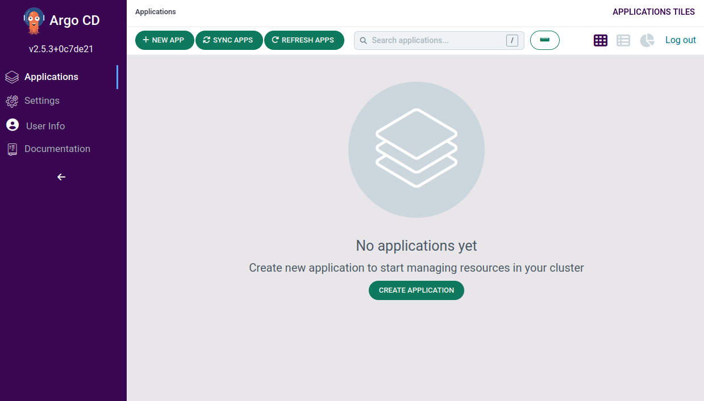
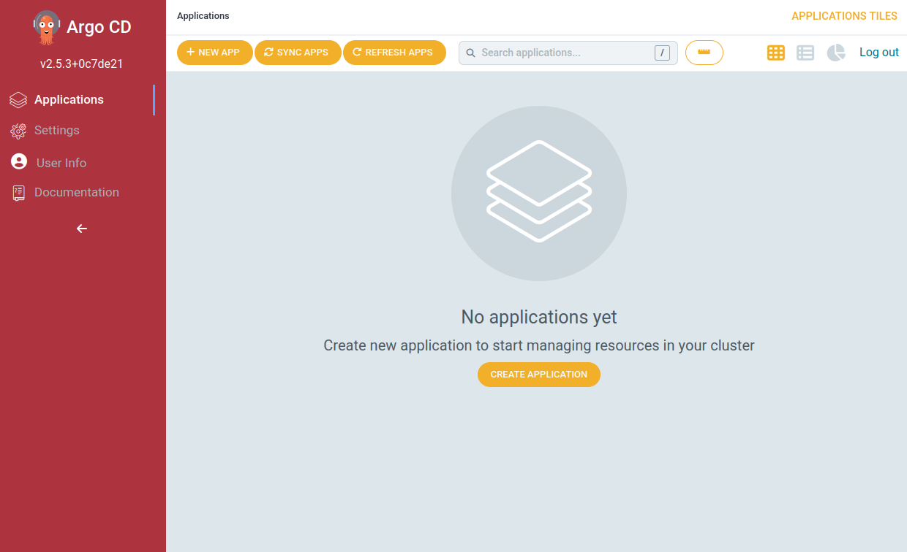
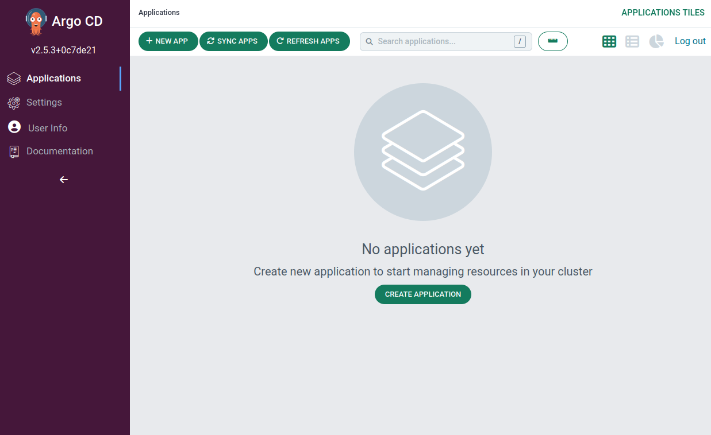
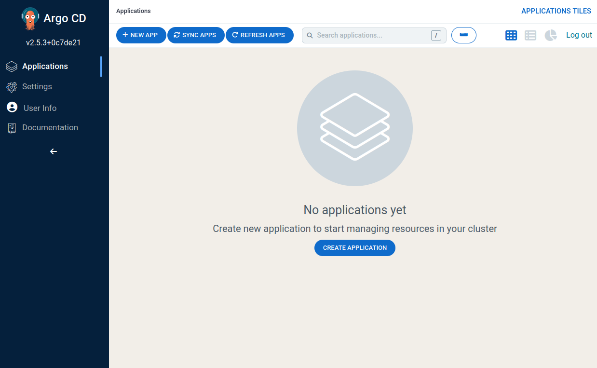
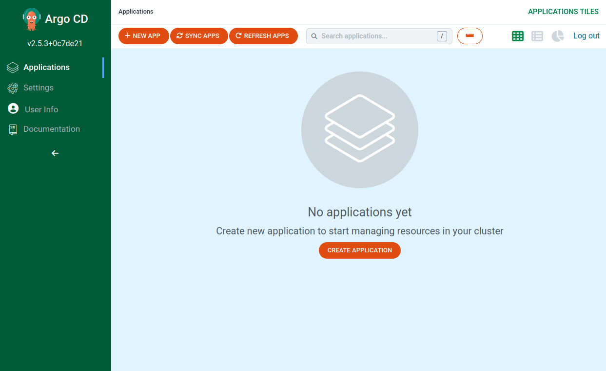
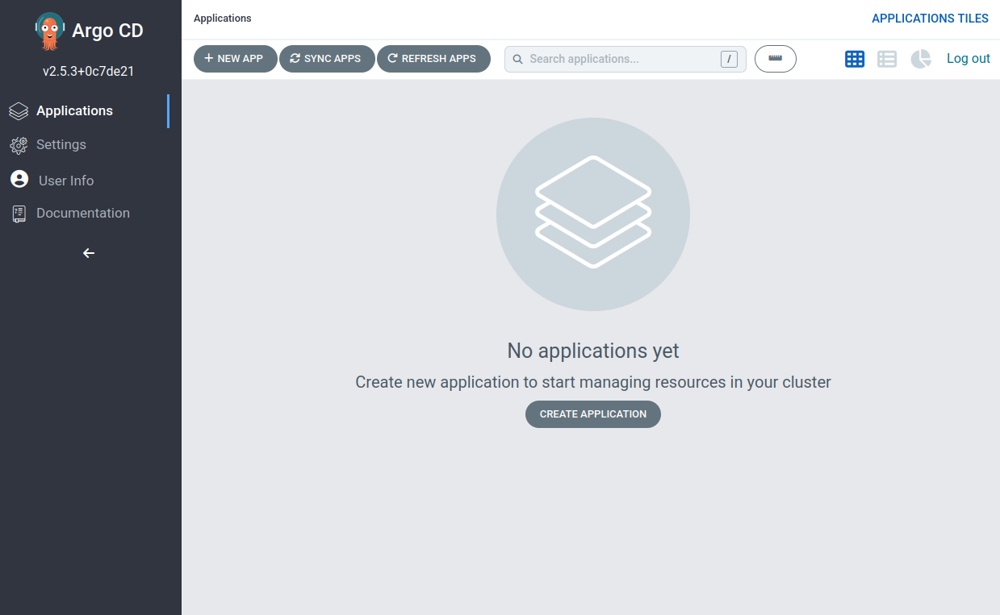
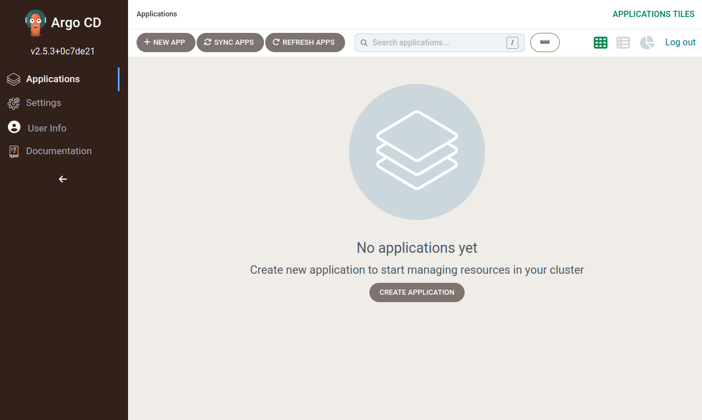

A collection of ArgoCD custom themes
------------------------------------

These themes are available as part of Akuity managed Argo-CD platform. I just look at the source and extract the custom CSS from there.

## Usage

- If you use Argo-CD helm chart, there's a styles option to inject custom styles.

- Copy the CSS of the theme you want and paste it there.

- And then, in `argocd-cm` configmap, add an entry for `ui.cssurl` like the [instruction here](https://argo-cd.readthedocs.io/en/stable/operator-manual/custom-styles/).

## Lavender theme

## Redold theme

## Slack theme

## Navy theme

## Beachball theme

## Asphalt theme

## Terra theme

